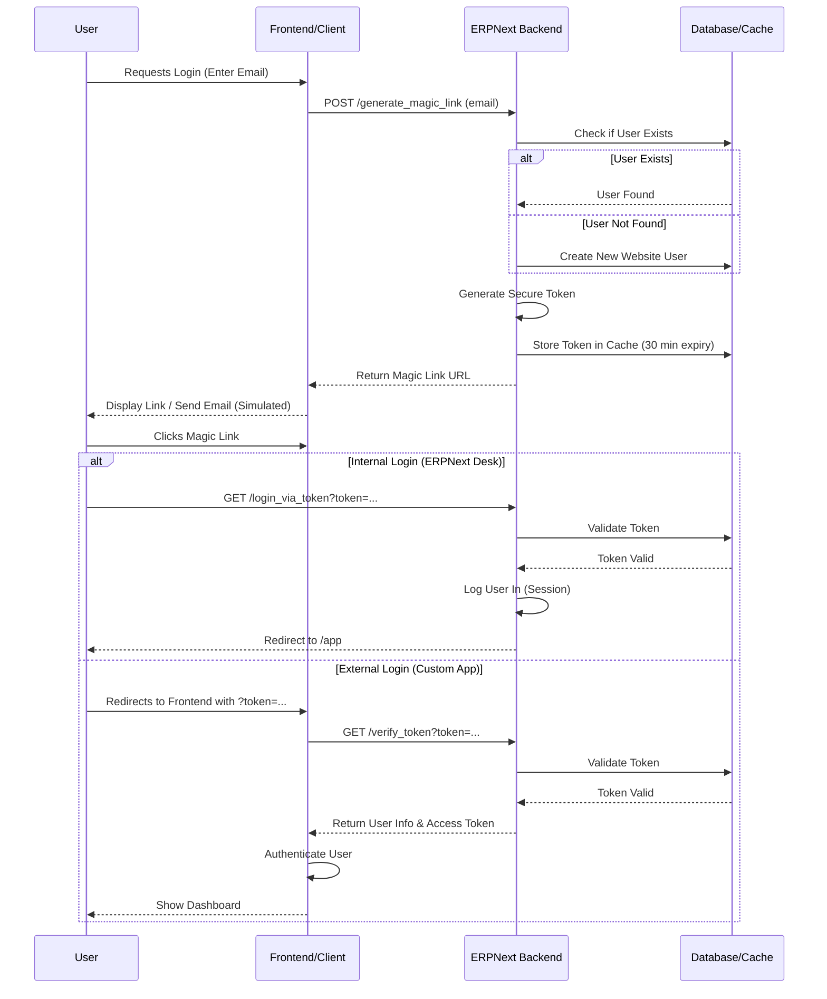

# Magic Link System Design

## Authentication Flow

```mermaid
sequenceDiagram
    participant User
    participant Frontend as Frontend/Client
    participant ERPNext as ERPNext Backend
    participant DB as Database/Cache

    User->>Frontend: Requests Login (Enter Email)
    Frontend->>ERPNext: POST /generate_magic_link (email)
    
    ERPNext->>DB: Check if User Exists
    alt User Exists
        DB-->>ERPNext: User Found
    else User Not Found
        ERPNext->>DB: Create New Website User
    end

    ERPNext->>ERPNext: Generate Secure Token
    ERPNext->>DB: Store Token in Cache (30 min expiry)
    ERPNext-->>Frontend: Return Magic Link URL

    Frontend-->>User: Display Link / Send Email (Simulated)
    
    User->>Frontend: Clicks Magic Link
    
    alt Internal Login (ERPNext Desk)
        User->>ERPNext: GET /login_via_token?token=...
        ERPNext->>DB: Validate Token
        DB-->>ERPNext: Token Valid
        ERPNext->>ERPNext: Log User In (Session)
        ERPNext-->>User: Redirect to /app
    else External Login (Custom App)
        User->>Frontend: Redirects to Frontend with ?token=...
        Frontend->>ERPNext: GET /verify_token?token=...
        ERPNext->>DB: Validate Token
        DB-->>ERPNext: Token Valid
        ERPNext-->>Frontend: Return User Info & Access Token
        Frontend->>Frontend: Authenticate User
        Frontend-->>User: Show Dashboard
    end
```
